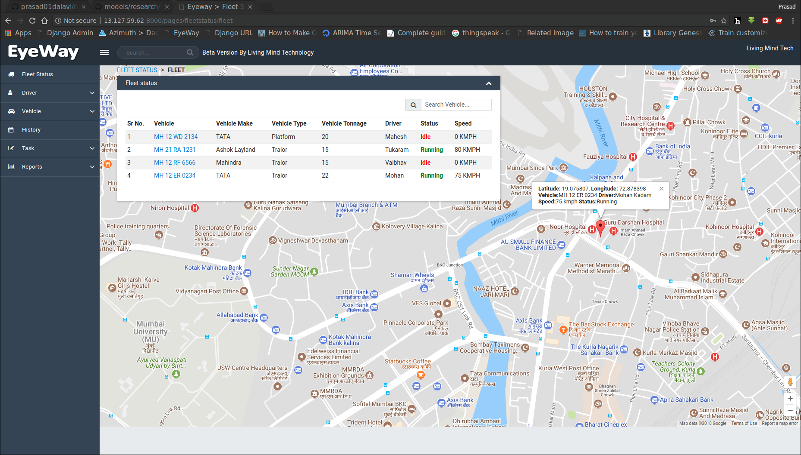
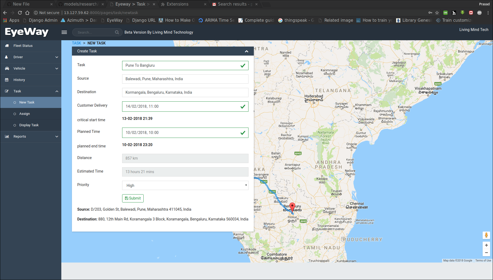

# Vehicle Tracking System
Task based vehicle tracking system with analytics

There are many vehicle tracking systems are available. The speciality of this one is Task based vehicle tracking. 
We can create a Task and assign it to a particular vehicle and track the status of the Task. In this way, the manager will be able to do his work in a very systematic manner.

Next thing is about Reports. We can get realtime report of all vehcles. E.g. which vehicle is on which task and what is the current location of that vehicle,
How much time will it take to complete the task assigned to it and much more things. Another report is about Task which indicated the Task completed by a particular vehicle.
This helps the manager to decide which vehicle is not giving its best, I mean how many task are completed on time, before time or completed with delay.
The next report is about Vehicle Utilization. It gives the % of the time for which it has been used or else manager can sell it if it not being used efficiently.

Dashboard:

  

Creating New Task:

  

Note: Screenshots are taken after deployment of project on AWS EC2 Instance but the code contains local server data
